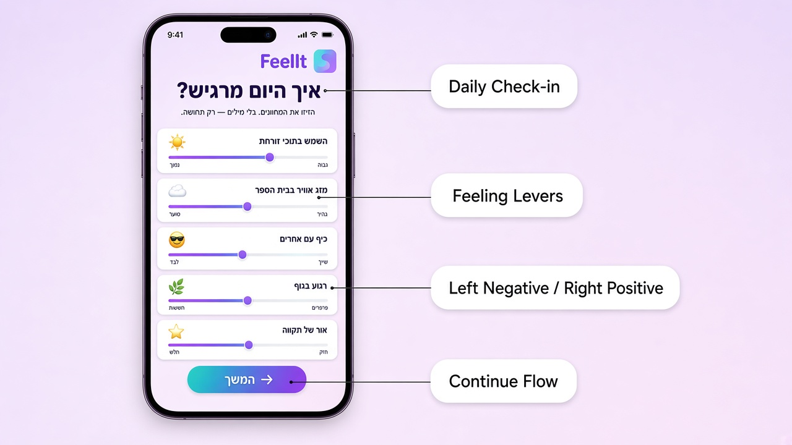
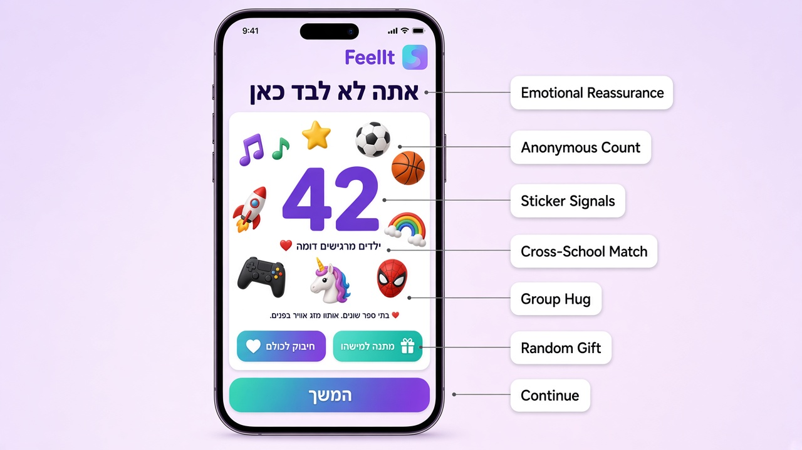
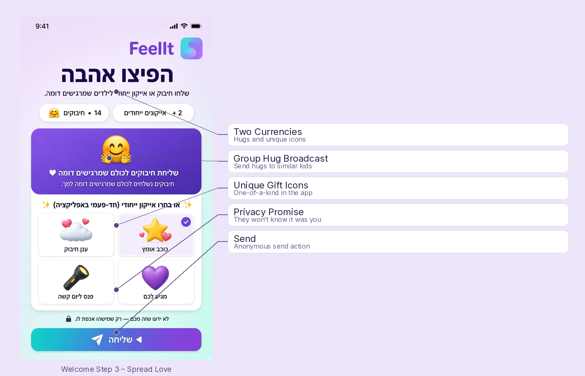
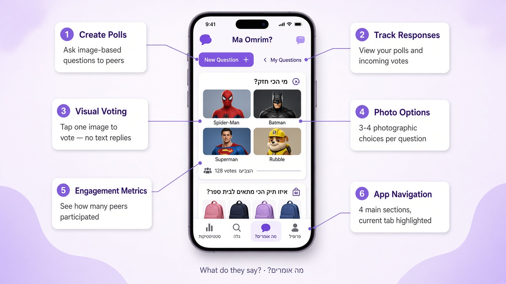
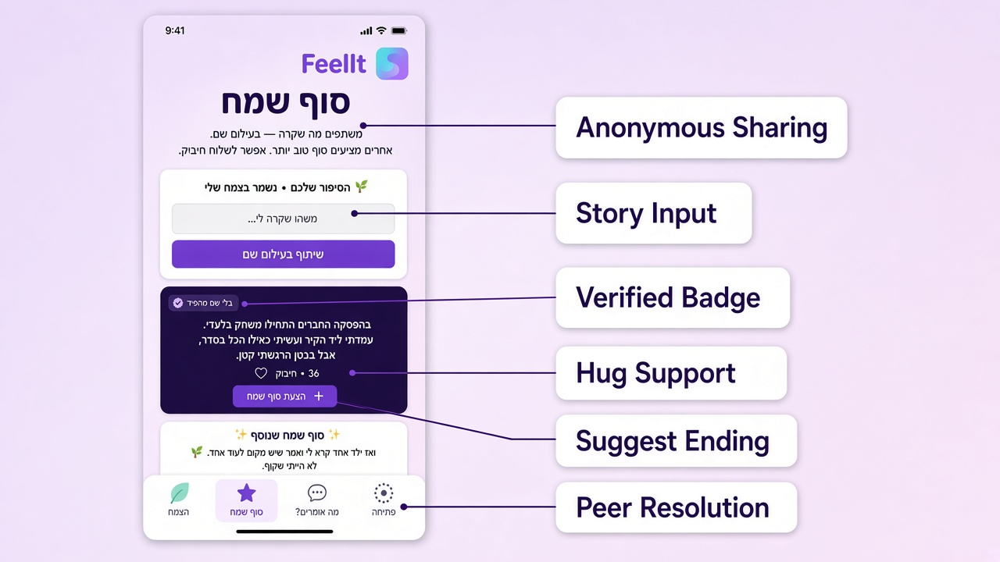
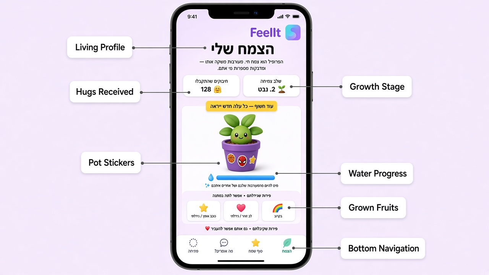

# FeelIt

**מרחב בטוח לילדים עד גיל 10 שחוו בריונות.** FeelIt עוזרת לילדים לבטא רגשות קשים, לראות שהם לא לבד, ולקבל חמימות מילדים אחרים — בלי הסיכונים של אינטראקציה חברתית פתוחה.

> ממשק v1 בעברית. המוקאפים מציגים את הממשק בעברית. הממשק עשוי להשתמש בפנייה בזכר או בנקבה באופן אקראי בין מסכים (לא רק ניסוח ניטרלי).

---

## עקרונות מנחים

### לא לעשות
1. **לא לאחסן מידע אישי** מעבר לעיר, שם פרטי וגיל.
2. **לא לאפשר לטקסט חופשי לכוון למשתמש אחר** — מונע הטרדה וחשיפת זהות.

### כן לעשות
1. **לעולם לא להשאיר משתמש תלוי** — כל פעולה מקבלת תגובה.
2. **להראות להם שהם לא לבד** — אחרים מרגישים ככה גם.
3. **לתת תקווה** — דברים יכולים להשתנות.
4. **להזמין חיבור בטוח** — אינטראקציה בין משתמשים שנשארת חיובית.

---

## מסכים

**ניווט אחיד באפליקציה:** כל המסכים חולקים את אותו סרגל ניווט תחתון עם ארבע לשוניות (מימין לשמאל: פתיחה · מה אומרים? · סוף שמח · הצמח). הלשונית הפעילה מודגשת בהתאם למסך הנוכחי. במסכי הפתיחה הלשונית פתיחה פעילה.

### תהליך פתיחה · פתיחה

תהליך צ'ק-אין יומי (3 שלבים). ללא טקסט חופשי — רק קלטים מובנים שבטוחים מעצם התכנון.

#### שלב 1 — איך אני מרגיש

ילדים מבטאים את מצבם הרגשי באמצעות חמישה מחוונים. כל מחוון משתמש בסקאלה של 1–5 עם קטבים אינטואיטיביים: שלילי משמאל, חיובי מימין. עוגנים ויזואליים (אייקוני אימוג'י) הופכים רגשות מופשטים למוחשיים עבור ילדים.

| מחוון | שמאל (1) | ימין (5) |
|-------|----------|----------|
| השמש בתוכי זורחת | נמוך | גבוה |
| מזג אוויר בבית הספר | סוער | בהיר |
| כיף עם אחרים | לבד | שייך |
| רגוע בגוף | חששות | פרפרים |
| אור של תקווה | חלש | חזק |

**להנדסה:**
- לשמור ערכי מחוונים למשתמש ליום
- לחשב ציון דמיון עבור התאמה בשלב 2
- אין שדות קלט טקסט במסך זה

---

#### שלב 2 — אתה לא לבד

אישור רגשי מיידי: ספירה בזמן אמת של ילדים אחרים שמרגישים בדומה. סביב הספירה, אשכול **מדבקות** (תחביבים, תחומי עניין, דמויות) שנדגמו מילדים עם רגשות דומים — מאפשרות חיבור אישי בלי לחשוף זהות. בלי שמות, בלי פרצופים, בלי בתי ספר.

**שתי פעולות אנונימיות** זמינות ישירות מהמסך:
- **חיבוק לכולם** — שליחת חיבוק לכל מי שמרגיש דומה בו-זמנית
- **מתנה למישהו** — שליחת מתנה ייחודית לילד אקראי אחד מהקבוצה

שתי הפעולות אנונימיות; המקבלים לעולם לא יודעים מי שלח.

**להנדסה:**
- שאילתה למשתמשים עם פרופיל מחוונים דומה (סף להגדרה בשאלות פתוחות)
- הצגת ספירה אנונימית + דגימת מדבקות אקראית מהקבוצה המתאימה
- רצפת גודל קבוצה מינימלי להגנה על קבוצות קטנות
- חיבוק קבוצתי: שידור לכל המשתמשים המתאימים
- מתנה אקראית: בחירת משתמש אקראי אחד מהקבוצה, מסירת מתנה באופן אנונימי

---

#### שלב 3 — הפיצו אהבה

שני מטבעות מאפשרים לילדים לשלוח חמימות בלי הודעות ישירות או קשר ישיר:

1. **חיבוקים** — יתרה משותפת; אפשר לשלוח חיבוקים לכולם בקבוצה עם רגשות דומים בבת אחת
2. **אייקונים ייחודיים** — מתנות חד-פעמיות שגודלו מפירות הצמח שלי

המקבלים לומדים רק שמישהו דאג — לא מי שלח.

**להנדסה:**
- הפחתת חיבוקים מיתרת השולח בשליחה
- שידור לכל המשתמשים בקבוצה המתאימה
- אייקונים ייחודיים הם חד-פעמיים; הסרה ממלאי השולח במתנה

---

### מה אומרים? · מה אומרים?

מעורבות בטוחה עם עמיתים דרך סקרים מבוססי תמונות. ילדים שואלים שאלות עם 3–4 אפשרויות תמונה; אחרים מצביעים בהקשה על תמונה אחת. ללא תגובות מוקלדות, ללא תגובות, ללא הודעות פרטיות — רק בחירות ויזואליות.

**פקדים עליונים:**
- **שאלה חדשה** — יצירת סקר מבוסס תמונות
- **השאלות שלי** — צפייה בשאלות שפרסמת ובהצבעות הנכנסות (נגיש מהמסך הראשי, ללא מוקאפ נפרד)

**להנדסה:**
- אחסון טקסט שאלה + 3–4 כתובות URL של תמונות לכל סקר
- הצבעה אחת למשתמש לשאלה
- צבירת ספירות הצבעות; זהות המצביע לא נחשפת

---

### סוף שמח · סוף שמח

שיתוף מה שקרה באנונימיות. קבלת סופים מלאי תקווה מעמיתים. סיפורים נהיים טובים יותר כאן.

- **שיתוף אנונימי** — ספרו את הסיפור שלכם בלי לחשוף זהות
- **הצעת סוף שמח** — תרמו תקווה לסיפור של מישהו אחר
- **שליחת חיבוקים** — תמיכה רגשית כתגובה
- סיפורים נשמרים באופן פרטי בפרופיל הצמח שלי של הכותב

**להנדסה:**
- סיפורים מאוחסנים עם הפניה לכותב (לא נחשפת בממשק)
- סופים מקושרים לסיפור האב
- ספירת חיבוקים לסיפור; התראה לכותב על סופים חדשים

---

### הצמח שלי · הצמח שלי

פרופיל כצמח צומח. כל מעורבות משקה אותו — החמימות שלכם ושל אחרים כלפיכם.

**ויזואל הצמח:**
- אמנות הצמח משתלבת בממשק (ללא מסגרת תמונה מלבנית)
- מתחיל קטן כדי שצמיחה/התפתחות תהיה גלויה לאורך זמן
- שלב הצמיחה משקף מעורבות מצטברת

**מדבקות זהות:** העציץ מכיל מדבקות (עיר, דמות, תחביב) שמאפשרות התאמה אישית בלי לחשוף מי אתם — אותה שפה ויזואלית כמו מדבקות העמיתים בשלב 2.

**חיבוקים שהתקבלו:** ספירה כוללת מוצגת בבולטות.

**מלאי פירות:**
1. **גודלו בצמח שלי** — פריטים ייחודיים שטיפחתם; ניתן להעניק לאחרים
2. **התקבלו כמתנות** — ניתן גם להעביר הלאה לאחרים

**להנדסה:**
- מעקב אחר נקודות צמיחה למשתמש (פעולות להגדרה בשאלות פתוחות)
- בחירת מדבקות מאוחסנת למשתמש
- טבלת בעלות פירות עם דגל "גודל" לעומת "התקבל"

---

## מוקאפים גולמיים

צילומי מסך מקוריים של הטלפון (ממשק בעברית) זמינים תחת `mocks/` לעיון הנדסי:

| מסך | קובץ |
|-----|------|
| פתיחה שלב 1 | `mocks/welcome-screen.png` |
| פתיחה שלב 2 | `mocks/welcome-not-alone.png` |
| פתיחה שלב 3 | `mocks/welcome-gift.png` |
| מה אומרים? | `mocks/what-do-they-say.png` |
| סוף שמח | `mocks/happy-ending.png` |
| הצמח שלי | `mocks/my-plant.png` |

---

## שאלות פתוחות

ראו [`OPEN-QUESTIONS.md`](OPEN-QUESTIONS.md) להחלטות שעדיין צריך לקבל.
