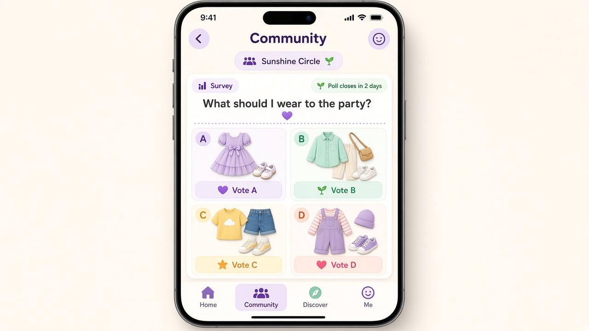
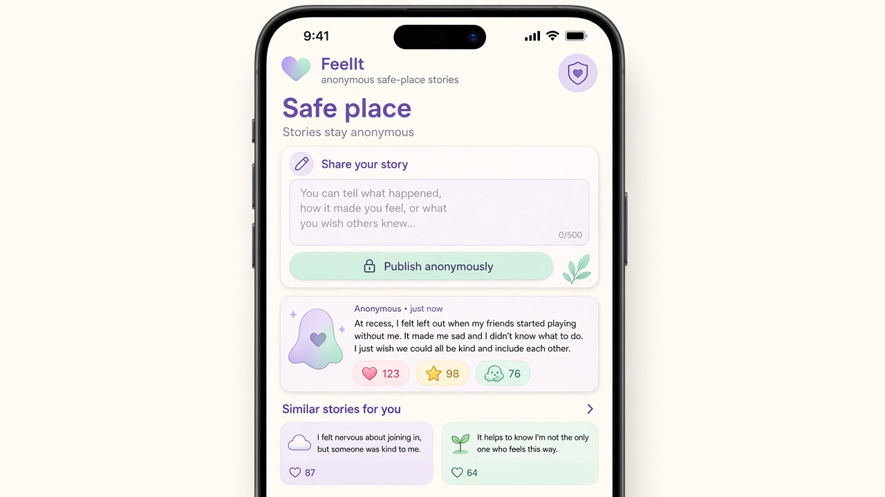

# FeelIt

FeelIt is an app supporting kids under 10 who have experienced bullying or social harassment.

---

## Purpose

FeelIt is an app designed to support **kids under 10** who have suffered, or are still suffering, from **bullying or other social harassment**.

The primary audience is young children who need:

- A safe space to process difficult social experiences
- A way to connect with peers who understand what they're going through
- Tools for self-expression without risk of further harassment

Young children experiencing bullying often lack safe outlets to share their experiences. FeelIt aims to provide a supportive environment where kids can:

1. Express how they're feeling day-to-day
2. Share experiences anonymously without fear of identification
3. Engage with a community in structured, safe ways
4. See that they're not alone in their experiences

---

## Tenets

These principles guide all product decisions for FeelIt.

### 1. Minimal Personal Information

**Do not collect personal details beyond what is strictly necessary.**

- The most private detail permitted is the user's **resident city**
- Avoid collecting names, schools, ages, photos of the user, or other identifying information unless absolutely required
- Design features to work with minimal user data

### 2. Safe Place / Anti-Harassment

**Prevent features from being abused to bully other members.**

This tenet has specific implications for how users can communicate:

**Prohibited:**
- Free text that one user can send to another user (direct messages, comments on others' posts)
- Free text broadcast publicly as directed interpersonal communication (replies, mentions, callouts)

**Permitted:**
- Free text about oneself for private self-expression (journaling, personal reflections for the user's own use)
- Structured responses (survey-style choices, badges, predefined reactions)

**Clarification:** The free-text restriction specifically prevents harassment within the app between users. It does not ban all text input—users can still write freely when the content is for themselves or when the interaction model prevents targeting other users.

---

## Welcome Screen

**Trigger:** First app open of the day

**Purpose:** Understand the user's overall mood and let them share good or bad experiences from that day.

**Format:**
- Prompt the user with **at most 3 basic questions**
- Questions should be simple and appropriate for children under 10

**Post-welcome:** Where the user lands after completing the Welcome screen is **not yet decided**. See Open Questions below.

---

## Screens

### Community Feed (Closed Questions / Surveys)

**Purpose:** Let users ask the community (or communities) closed questions in a structured, safe format.

**How it works:**
1. A user creates a post with a question
2. The user can attach **up to 4 images** as options
3. The user defines **possible responses** (survey-style choices)
4. Other users respond by selecting from the predefined choices

**Example:**
> "What should I wear to this event?"
> - [Image 1: Blue dress]
> - [Image 2: Red shirt]
> - [Image 3: Green sweater]
> - [Image 4: Yellow jacket]

**Safety note:** Responses are **structured choices only**—no open free-text replies to the poster. This prevents the feature from being used to send hurtful messages.

### Anonymous Safe-Place Stories (Unpleasant Events)

**Purpose:** Provide a safe place for users to tell stories about unpleasant events that happened to them.

**Privacy by design:**
- The story author's identity is **NOT stored in the backend**
- It must be **impossible to associate a story with a user**
- This is a core architectural requirement, not just a UI choice

**Features on this screen:**
1. **View other users' stories** — read anonymous experiences from the community
2. **Engage via badges** — react to stories using badges (not free-text comments)
3. **See similar stories** — after publishing a story, show the user other similar stories from other users

**Design intent:** Help users feel less alone by seeing that others have had similar experiences, while protecting everyone's identity.

---

## Open Questions

The following decisions are not yet finalized and require further discussion.

### Navigation & Information Architecture
- **Post-welcome landing:** What screen does the user see after completing the Welcome screen?
- **Full in-app navigation:** How do users move between screens? What's the primary navigation model?
- **Information architecture:** How are features organized and discovered?

### Welcome Screen Content
- **Exact questions:** What specific questions are asked on the Welcome screen?
- **Question format:** Multiple choice? Emoji-based? Slider scales?
- **Personalization:** Do questions adapt based on previous answers or user history?

### Community Model
- **Single vs. multiple communities:** Is there one global community, or can users join/create multiple communities?
- **Community joining:** How do kids discover and join communities?
- **Community scope:** Are communities geographic, interest-based, age-based, or something else?

### Parental Involvement
- **Parent/guardian role:** Do parents have visibility or control over their child's account?
- **Consent flow:** How is parental consent obtained for users under 10?
- **Parent notifications:** Are parents notified of any activity or content?

### Content Moderation
- **Anonymous story moderation:** How are anonymous stories reviewed for harmful content without compromising anonymity?
- **Survey image moderation:** How is image content in community surveys moderated?
- **Reporting mechanism:** How can users report concerning content?
- **Moderation team:** Who moderates content and how quickly?

---

## Mockups

### Welcome Screen

First-open-of-day mood prompt ("How are you today?", screen 1 of 3). Users select from structured mood options: Good, Okay, or Not great.

### Community Feed (Survey)

Community survey screen showing a closed question ("What should I wear to the party?") with up to 4 image options. Users vote via structured choices, not free-text replies.

### Anonymous Safe-Place Stories

Safe place for sharing anonymous stories about unpleasant experiences. Shows story input, "Publish anonymously" action, other users' stories with badge reactions, and "Similar stories for you" section.

### Still to be designed

- **Post-Welcome Landing** — Home screen after the Welcome screen (design pending decision on navigation)
