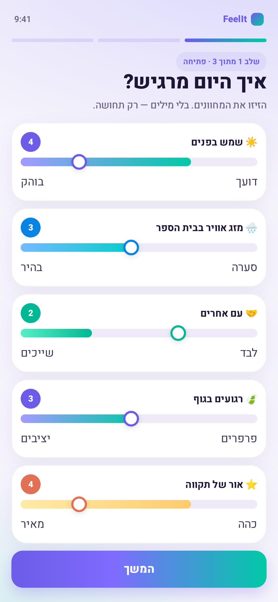
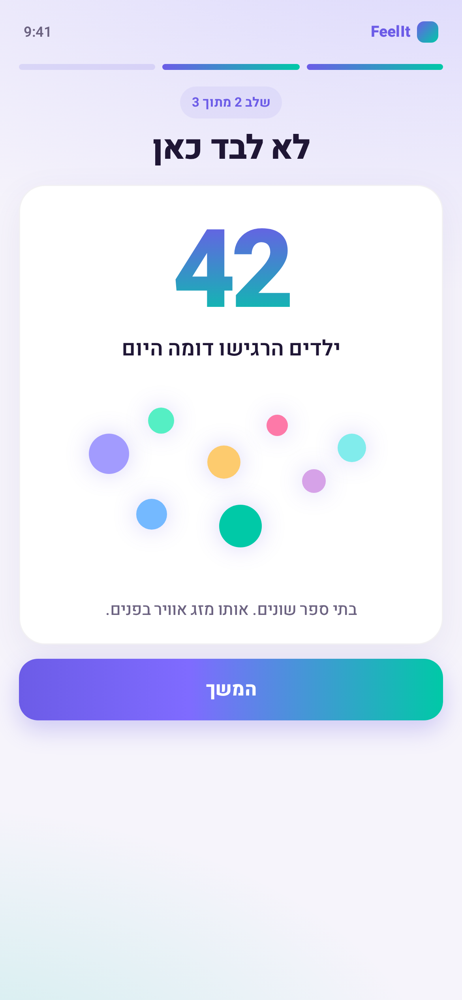
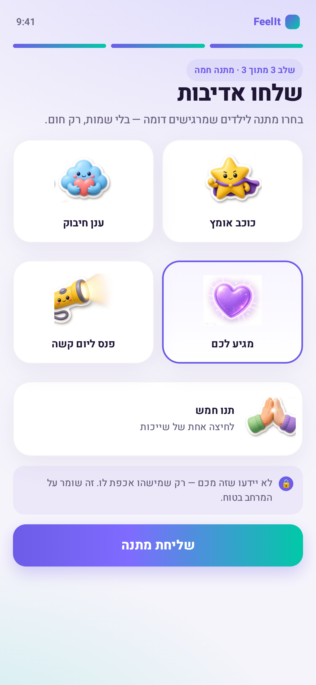
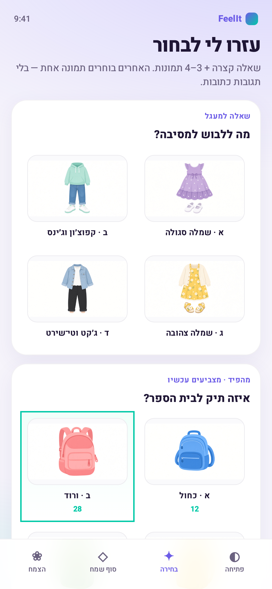
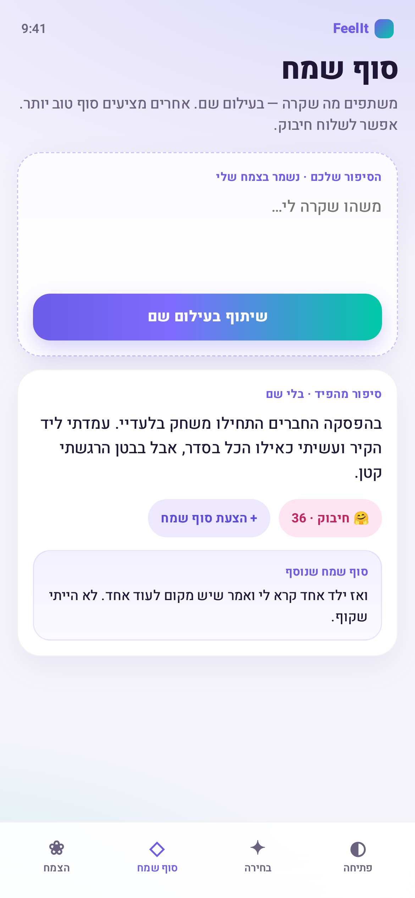
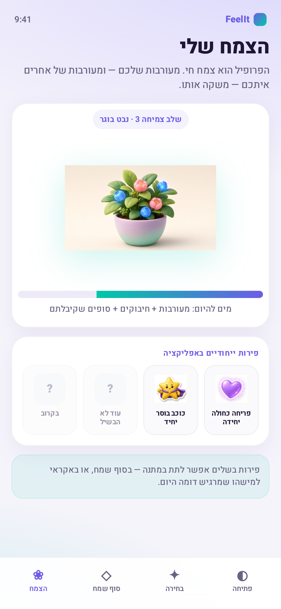

# FeelIt

**A safe space for kids under 10 who've experienced bullying.** FeelIt helps children express difficult feelings, see they're not alone, and receive kindness from peers—without the risks of open social interaction.

> v1 ships in Hebrew (gender-neutral UI). Mocks below are production-intent iPhone portraits.

---

## Tenets

### Don'ts
1. **Don't store personal information** beyond city, first name, and age.
2. **Don't let free text target another user** — prevents harassment and outing.

### Do's
1. **Never leave a user hanging** — every engagement gets a response.
2. **Show them they're not alone** — others feel this too.
3. **Give hope** — things can change.
4. **Invite safe connection** — cross-user engagement that stays kind.

---

## Screens

### Welcome / פתיחה

Daily check-in flow (3 steps). No free text.

#### Step 1 — How I Feel

Five feeling levers (1–5 scale), using kid-friendly metaphors:

| Lever | Hebrew |
|-------|--------|
| Sunshine inside | שמש בפנים |
| School weather | מזג אוויר בבית הספר |
| With others | עם אחרים |
| Steady body | רגועים בגוף |
| Hope light | אור של תקווה |

#### Step 2 — You're Not Alone / לא לבד כאן

Shows an anonymous count of kids with similar feelings today. No names, no faces—just reassurance.

#### Step 3 — Send Kindness / שלחו אדיבות

Pick one kindness gift to send anonymously to that similar-feeling group:

| Gift | Hebrew |
|------|--------|
| Brave star | כוכב אומץ |
| Hug cloud | ענן חיבוק |
| You-matter heart | מגיע לכם |
| Flashlight | פנס ליום קשה |
| High-five | תנו חמש |

Recipients learn only that someone cared—not who.

---

### Help Me Choose / עזרו לי לבחור

Safe peer engagement through image-based polls.

- Asker posts a question + 3–4 images
- Others vote by tapping one image
- No typed replies, no comments, no DMs

---

### Happy Ending / סוף שמח

Share what happened. Receive hopeful endings from others.

- User writes a story, posts anonymously
- Others suggest happy endings or send hugs (חיבוק)
- Author gets notified—never left hanging
- Stories saved privately on the author's My Plant profile

---

### My Plant / הצמח שלי

Profile as a growing plant.

- Every engagement waters it (yours and others' toward you)
- Plant evolves visually through growth stages
- Grows **unique fruits** (app-wide unique icons)
- Ripe fruits can be gifted to other users

---

## Open Questions

See [`OPEN-QUESTIONS.md`](OPEN-QUESTIONS.md) for decisions still to be made.
