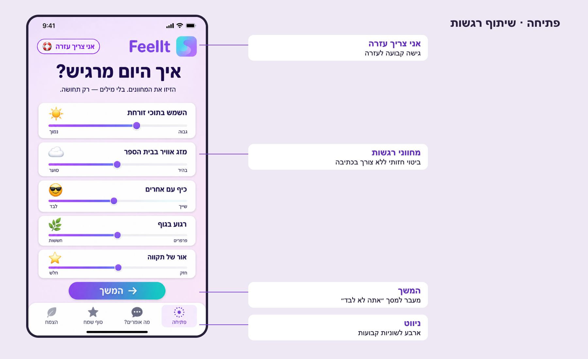
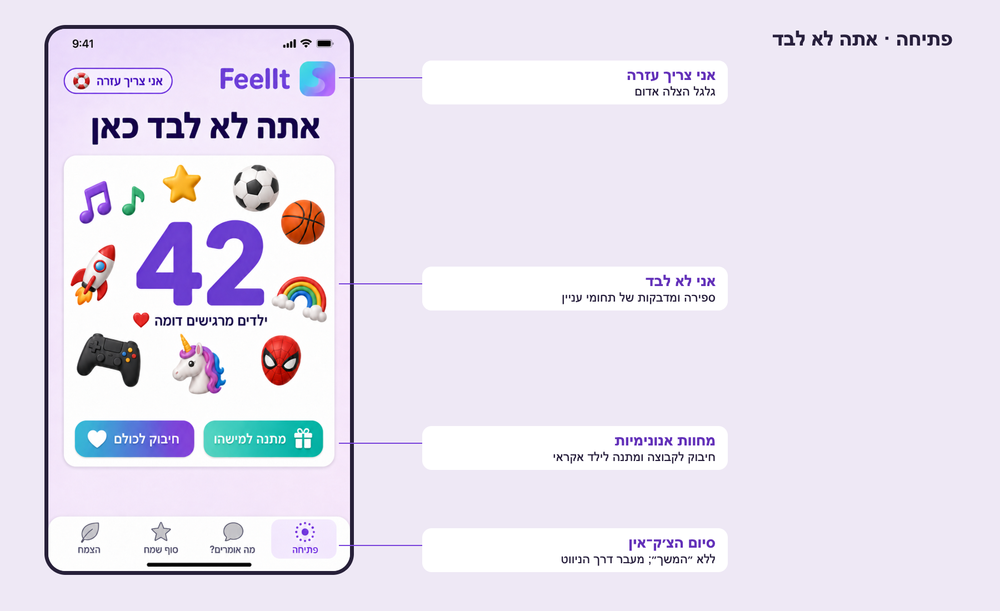
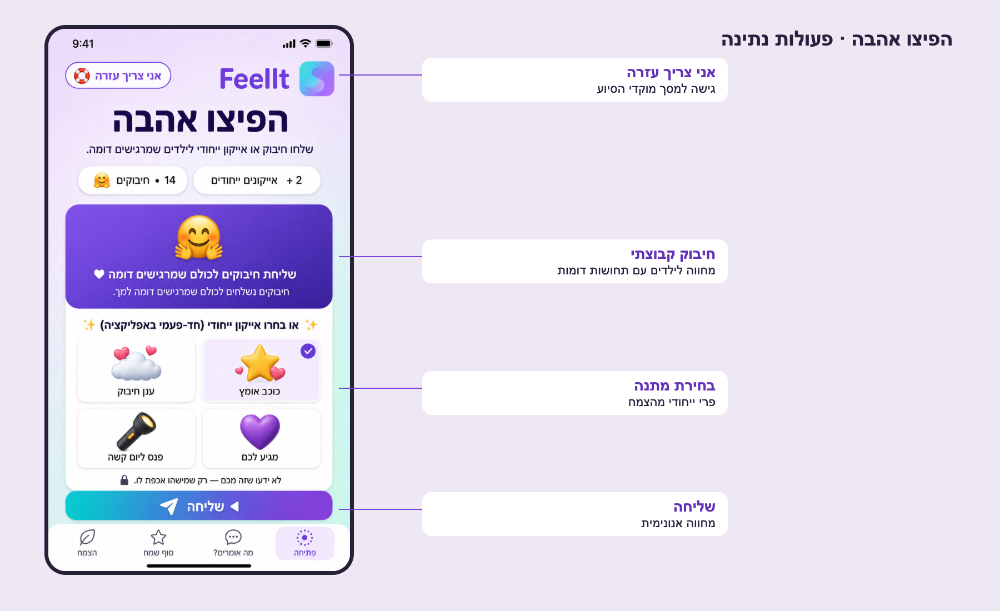
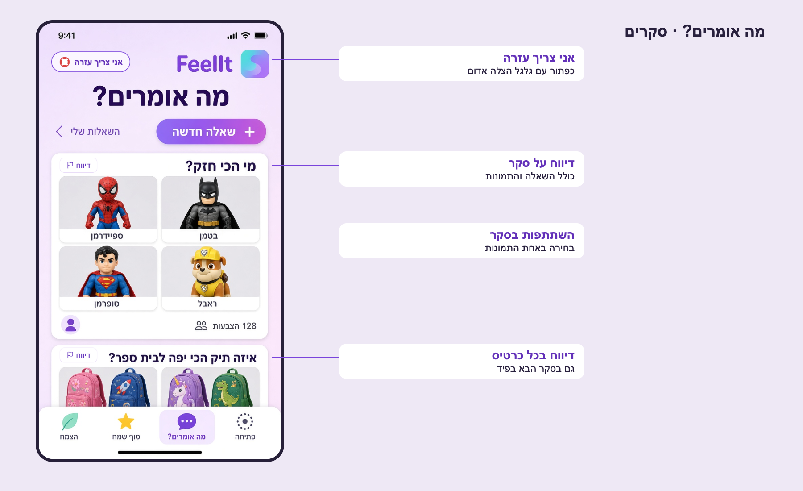
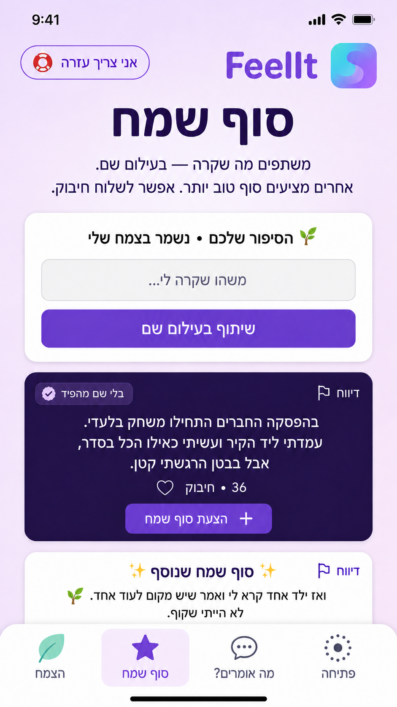
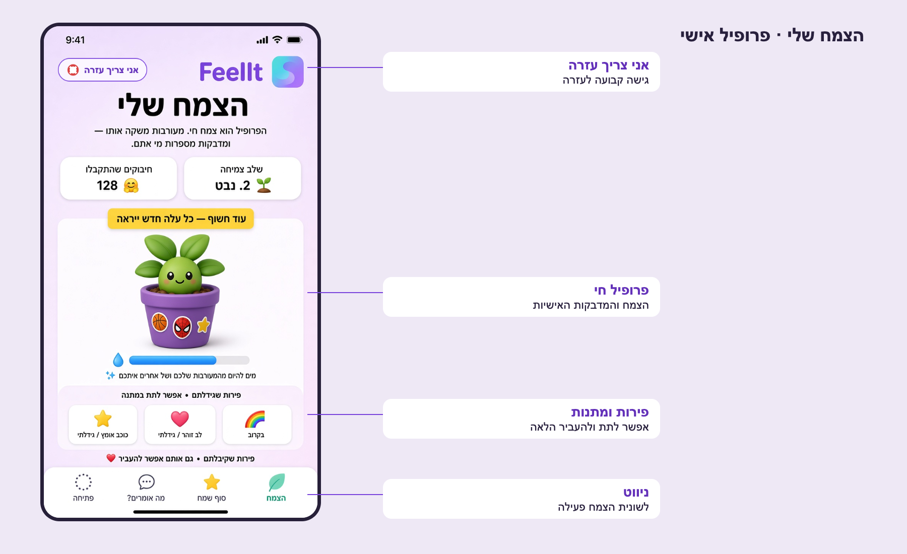
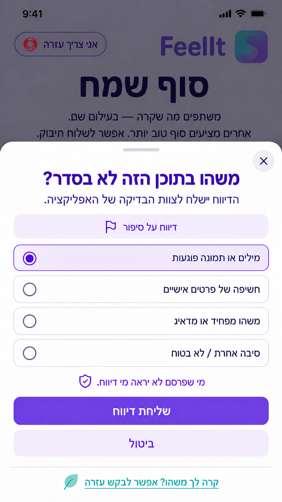
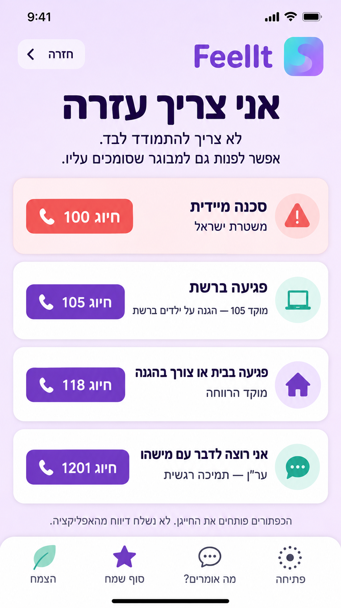

# FeelIt

**מרחב בטוח לתלמידי בית ספר יסודי שחוו בריונות.** FeelIt עוזרת לילדים לבטא רגשות קשים, לראות שהם לא לבד, ולקבל חמימות מילדים אחרים — בלי הסיכונים של אינטראקציה חברתית פתוחה.

> ממשק v1 בעברית. המוקאפים מציגים את הממשק בעברית. הממשק עשוי להשתמש בפנייה בזכר או בנקבה באופן אקראי בין מסכים (לא רק ניסוח ניטרלי).

---

## עקרונות מנחים

### לא לעשות
1. **לא לאחסן מידע אישי** מעבר לעיר, שם פרטי, גיל ומגדר.
2. **לא לאפשר לטקסט חופשי לכוון למשתמש אחר** — מונע הטרדה וחשיפת זהות.

### כן לעשות
1. **לעולם לא להשאיר משתמש תלוי באוויר** — כל פעולה מקבלת תגובה.
2. **להראות להם שהם לא לבד** — אחרים מרגישים ככה גם.
3. **לתת תקווה** — דברים יכולים להשתנות.
4. **להזמין חיבור בטוח** — אינטראקציה בין משתמשים שנשארת חיובית.

---

## מודל האפליקציה

לכל משתמש יש **פרופיל** שמיוצג על ידי **צמח**.

הצמח צומח ככל שהמשתמש מביע יותר רגשות ומקיים יותר אינטראקציה בתוך האפליקציה. כשהצמח גדל, הוא מייצר **פירות** — בפועל **אייקונים ייחודיים**. לכל אייקון יש ייצוג יחיד באפליקציה מול כל המשתמשים. את הפירות אפשר לתת במתנה למשתמשים אחרים כתגובה לאינטראקציה שלהם (כפי שיופיע במסכים בהמשך).

בנוסף לצמח, הפרופיל מציג את **כמות החיבוקים** שהמשתמש צבר עד כה — סך כל החיבוקים שקיבל על כל האינטראקציות שביצע, בדומה לסך הלייקים שקיבל בפלטפורמה. כל אינטראקציה באפליקציה יכולה לזכות בחיבוקים ממשתמשים אחרים.

בפרופיל אפשר גם להוסיף **מדבקות** שמאפיינות דברים שהמשתמש אוהב (למשל ספיידרמן או כדורסל), כדי לתת לפרופיל נופך אישי. לכל פרופיל יש לפחות מדבקה אחת שמייצגת את **העיר** שבה הוא גר.

---

## מסכים

**ניווט אחיד באפליקציה:** כל המסכים חולקים את אותו סרגל ניווט תחתון עם ארבע לשוניות (מימין לשמאל: פתיחה · מה אומרים? · סוף שמח · הצמח). הלשונית הפעילה מודגשת בהתאם למסך הנוכחי. במסכי הפתיחה הלשונית פתיחה פעילה.

**גישה לעזרה:** כפתור עליון ״אני צריך עזרה״ עם אייקון גלגל הצלה אדום מופיע בכל ששת מסכי התוכן, ללא לשונית חמישית. הוא פותח את מסך מוקדי הסיוע, שבו כפתור חזרה.

### תהליך פתיחה · פתיחה

תהליך צ'ק-אין יומי בשני שלבים: ״איך אני מרגיש״ ולאחריו ״אתה לא לבד״. ללא טקסט חופשי — רק קלטים מובנים שבטוחים מעצם התכנון.

#### שלב 1 — איך אני מרגיש

ילדים מבטאים את מצבם הרגשי באמצעות חמישה מחוונים. כל מחוון משתמש בסקאלה של 1–5 עם קטבים אינטואיטיביים: שלילי משמאל, חיובי מימין. עוגנים ויזואליים (אייקוני אימוג'י) הופכים רגשות מופשטים למוחשיים עבור ילדים.

| מחוון | שמאל (1) | ימין (5) |
|-------|----------|----------|
| השמש בתוכי זורחת | נמוך | גבוה |
| מזג אוויר בבית הספר | סוער | בהיר |
| כיף עם אחרים | לבד | שייך |
| רגוע בגוף | חששות | פרפרים |
| אור של תקווה | חלש | חזק |

---

#### שלב 2 — אתה לא לבד

אישור רגשי מיידי: ספירה בזמן אמת של ילדים אחרים שמרגישים בדומה. סביב הספירה, אשכול **מדבקות** (תחביבים, תחומי עניין, דמויות) שנדגמו מילדים עם רגשות דומים — מאפשרות חיבור אישי בלי לחשוף זהות. בלי שמות, בלי פרצופים, בלי בתי ספר.

**שתי פעולות אנונימיות** זמינות ישירות מהמסך:
- **חיבוק לכולם** — שליחת חיבוק לכל מי שמרגיש דומה בו-זמנית
- **מתנה למישהו** — שליחת מתנה ייחודית לילד אקראי אחד מהקבוצה

שתי הפעולות אנונימיות; המקבלים לעולם לא יודעים מי שלח.

זהו מסך הסיום של הצ'ק-אין. אין בו כפתור ״המשך״ ואין מעבר אוטומטי למסך נוסף. אפשר להשתמש בפעולות האנונימיות או לעבור לחלק אחר באפליקציה דרך סרגל הניווט התחתון.

---

#### הפיצו אהבה — פירוט פעולות הנתינה

המוקאפ הבא מפרט את פעולות הנתינה הזמינות מתוך ״אתה לא לבד״; הוא אינו שלב שלישי חובה בצ'ק-אין.

שני מטבעות מאפשרים לילדים לשלוח חמימות בלי הודעות ישירות או קשר ישיר:

1. **חיבוקים** — יתרה משותפת; אפשר לשלוח חיבוקים לכולם בקבוצה עם רגשות דומים בבת אחת
2. **אייקונים ייחודיים** — מתנות חד-פעמיות שגודלו מפירות הצמח שלי, או שקיבלתי ממשתמשים אחרים

המקבלים לומדים רק שמישהו דאג — לא מי שלח.

---

### מה אומרים? · מה אומרים?

מעורבות בטוחה עם עמיתים דרך סקרים מבוססי תמונות. ילדים שואלים שאלות עם 3–4 אפשרויות תמונה; אחרים מצביעים בהקשה על תמונה אחת. ללא תגובות מוקלדות, ללא תגובות, ללא הודעות פרטיות — רק בחירות ויזואליות.

**פקדים עליונים:**
- **שאלה חדשה** — יצירת סקר מבוסס תמונות
- **השאלות שלי** — צפייה בשאלות שפרסמת ובהצבעות הנכנסות (נגיש מהמסך הראשי, ללא מוקאפ נפרד)

---

### סוף שמח · סוף שמח

שיתוף מה שקרה באנונימיות. קבלת סופים מלאי תקווה מעמיתים. סיפורים נהיים טובים יותר כאן.

הגרסה עם ההערות ב־`mocks/annotated/happy-ending-annotated.png` מסמנת גם את כפתורי הדיווח והעזרה.

- **שיתוף אנונימי** — ספרו את הסיפור שלכם בלי לחשוף זהות
- **הצעת סוף שמח** — תרמו תקווה לסיפור של מישהו אחר
- **שליחת חיבוקים** — תמיכה רגשית כתגובה
- סיפורים נשמרים באופן פרטי בפרופיל הצמח שלי של הכותב

---

### הצמח שלי · הצמח שלי

פרופיל כצמח צומח. כל מעורבות משקה אותו — החמימות שלכם ושל אחרים כלפיכם.

**ויזואל הצמח:**
- אמנות הצמח משתלבת בממשק (ללא מסגרת תמונה מלבנית)
- מתחיל קטן כדי שצמיחה/התפתחות תהיה גלויה לאורך זמן
- שלב הצמיחה משקף מעורבות מצטברת

**מדבקות זהות:** העציץ מכיל מדבקות (עיר, דמות, תחביב) שמאפשרות התאמה אישית בלי לחשוף מי אתם — אותה שפה ויזואלית כמו מדבקות העמיתים בשלב 2.

**חיבוקים שהתקבלו:** ספירה כוללת מוצגת בבולטות.

**מלאי פירות:**
1. **גודלו בצמח שלי** — פריטים ייחודיים שטיפחתם; ניתן להעניק לאחרים
2. **התקבלו כמתנות** — ניתן גם להעביר הלאה לאחרים

---

### דיווח על תוכן

ליד כל פריט תוכן שמשתמשים פרסמו יופיע כפתור גלוי ״דיווח״: סקר (כולל הטקסט והתמונות שלו), סיפור, וכל תגובה או סוף מוצע. אם יתווספו העלאות לפרופיל, המנגנון יחול גם על תוכן זה כשהוא מוצג לאחרים. אין צורך בכפתור על טיוטה פרטית שטרם פורסמה.

לחיצה פותחת חלונית שמזהה את סוג הפריט ומציעה ארבע סיבות: מילים או תמונה פוגעות, חשיפה של פרטים אישיים, משהו מפחיד או מדאיג, וסיבה אחרת / לא בטוח. אין חובה להקליד הסבר. השליחה מיועדת לצוות הבדיקה של האפליקציה; מפרסם התוכן לא יראה את זהות המדווח.

לאחר שליחה מוצלחת יוצג אישור קבלה לבדיקה, ולא הבטחה להסרה או לטיפול שכבר בוצע. במקרה של תקלה יש להציג שהדיווח לא נשלח ולאפשר ניסיון חוזר. צוות הבדיקה, הרשאותיו וזמני המענה עדיין דורשים הגדרה לפני הפעלה.

### אני צריך עזרה

מסך עזרה משותף, נפרד מדיווח על תוכן באפליקציה, עם כפתור חזרה וארבע אפשרויות פנייה בישראל:

| צורך | גורם | מספר |
|-----|------|------|
| סכנה מיידית | משטרת ישראל | 100 |
| פגיעה ברשת | מוקד הגנה על ילדים ברשת | 105 |
| פגיעה בבית או צורך בהגנה | מוקד הרווחה | 118 |
| רצון לדבר עם מישהו | ער״ן — תמיכה רגשית | 1201 |

כפתור חיוג פותח את חייגן המכשיר עם המספר; המשתמש מחליט אם להתחיל את השיחה. אין שיחה אוטומטית ואין שליחת דיווח לרשויות מתוך האפליקציה. אין צורך להשלים דיווח על תוכן או לכתוב מה קרה כדי לגשת לעזרה. המסך מזמין גם פנייה למבוגר שסומכים עליו.

המספרים נבדקו ב־1 באוקטובר 2026 מול [מוקד 105 וההנחיה לפנות ל־100 בחשש לחיי אדם](https://www.gov.il/he/Departments/Units/105_call_center), [מוקד הרווחה 118](https://www.gov.il/he/pages/molsa-domestic-violence-protection?chapterIndex=1) ו[ער״ן](https://www.eran.org.il/services/). הצגתם אינה מעידה על שותפות עם האפליקציה.

אלה מוקאפים ודרישות מוצר; מנגנוני הדיווח והחיוג אינם ממומשים בקוד במסגרת עדכון זה. כפתורי דיווח מוצגים על כל סקר ועל כל סיפור ותגובה, וכפתור העזרה מוצג בכל מסכי התוכן. גם שש גרסאות המוקאפים עם ההערות עודכנו.

---

## מוקאפים גולמיים

צילומי מסך מקוריים של הטלפון (ממשק בעברית) זמינים תחת `mocks/` לעיון הנדסי:

| מסך | קובץ |
|-----|------|
| פתיחה שלב 1 | `mocks/welcome-screen.png` |
| פתיחה שלב 2 | `mocks/welcome-not-alone.png` |
| פירוט פעולות הנתינה | `mocks/welcome-gift.png` |
| מה אומרים? | `mocks/what-do-they-say.png` |
| סוף שמח | `mocks/happy-ending.png` |
| הצמח שלי | `mocks/my-plant.png` |
| דיווח על תוכן | `mocks/report-content.png` |
| אני צריך עזרה | `mocks/get-help.png` |

---

## שאלות פתוחות

ראו [`OPEN-QUESTIONS.md`](OPEN-QUESTIONS.md) להחלטות שעדיין צריך לקבל.

## מצגת המוצר

- [PDF להצגה ולשיתוף](presentations/FeelIt-Product-HE.pdf)
- [PowerPoint לעריכה](presentations/FeelIt-Product-HE.pptx)
- [גרסת HTML עצמאית](presentations/FeelIt-Product-HE.html)

המצגת כוללת 17 שקפים, כולל דיווח על תוכן ומסך העזרה. תכנון ההצגה: כ־28 דקות ועוד עד 10 דקות לדיון.

מקור המצגת הוא `presentations/build.py`, המשתמש במוקאפים שבתיקיית `mocks/`. להרצה: `uv run --no-project --with python-pptx presentations/build.py`. הפקת PDF ובדיקת עימוד: `uv run --no-project --with playwright --with pillow presentations/render.py` (הסקריפט משתמש ב־Google Chrome המותקן ב־macOS).
